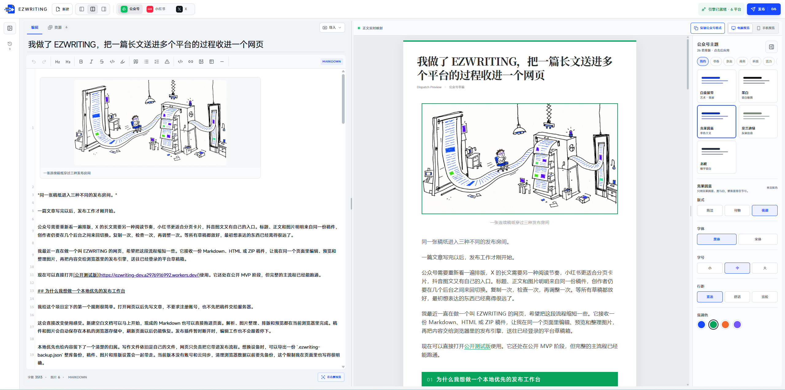
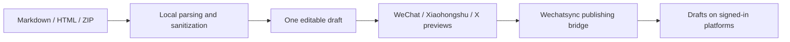
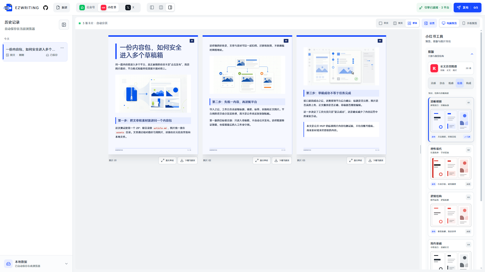
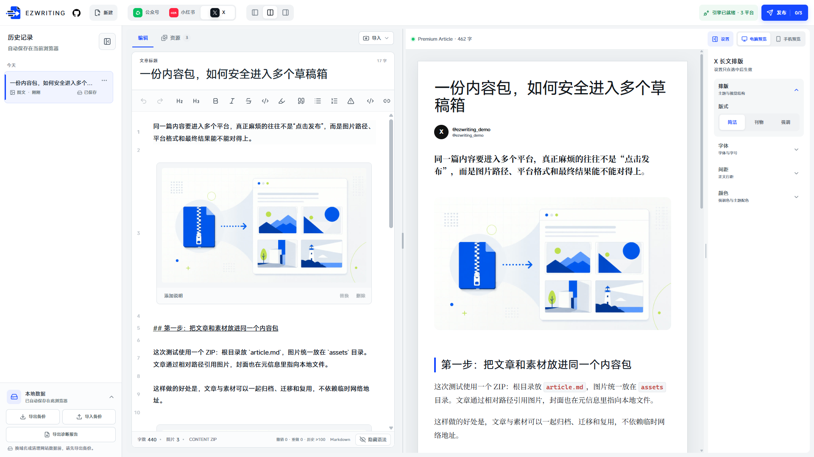

<div align="right">
  <a href="./README_ZH.md">简体中文</a> · <strong>English</strong>
</div>

<div align="center">

# EZWRITING

**A local-first workspace for multi-platform content publishing**

Bring a Markdown, HTML, or ZIP article into the browser, then edit, organize images, preview platform-specific layouts, and create drafts from one workspace.

[Live demo](https://ezwriting.online/) · [Quick start](#quick-start) · [Platform support](./docs/PLATFORM_SUPPORT.md) · [Roadmap](./ROADMAP.md) · [简体中文](./README_ZH.md)

[](https://github.com/KeepATARAXIA/ezWriting/actions/workflows/ci.yml)
[](./CHANGELOG.md)
[](./LICENSE)

</div>



> [!IMPORTANT]
> EZWRITING is currently a public MVP. A desktop version of Chrome, Edge, or another Chromium browser is recommended. Importing, editing, previewing, backing up data, and exporting images work without an account. Multi-platform draft delivery requires the [Wechatsync](https://github.com/wechatsync/Wechatsync) browser extension and active sessions on the target platforms.

Current version: **v0.1.0**. Before testing draft delivery, review the dated [platform support matrix](./docs/PLATFORM_SUPPORT.md) and [known issues](./docs/KNOWN_ISSUES.md). Platform behavior can change independently of EZWRITING.

## Why EZWRITING exists

Finishing a long-form article is often only the beginning of the publishing process. WeChat needs its own formatting pass, X Article has a different reading rhythm, Xiaohongshu works better as paginated cards, and every other platform introduces another set of image and draft requirements. Repeated copying, pasting, image uploads, and dashboard switching consume time and gradually pull each version away from the original draft.

EZWRITING brings that process into one browser workspace:



The core rule is simple: one source, multiple platform presentations. The editor keeps one canonical Markdown draft, while WeChat, Xiaohongshu, and X apply their own preview and formatting logic. This prevents three independently edited versions from drifting apart.

## Core capabilities

| Stage | What EZWRITING provides |
| --- | --- |
| Import | Markdown, HTML, ZIP content packages, and folders containing an article with its images |
| Normalize | Front matter, title, summary, tags, cover image, standard Markdown images, and Obsidian image references |
| Edit | A Markdown editor with headings, lists, quotes, callouts, code, tables, links, highlights, images, shortcuts, undo, and redo |
| Preview | Dedicated views for WeChat Official Account articles, Xiaohongshu image cards, and X Article |
| Format | Themes, fonts, type sizes, line spacing, and accent colors shared by previews and delivery payloads |
| Save locally | Drafts, images, and layout settings stored in IndexedDB, with full-library backup import and export |
| Deliver | Wechatsync detection, platform selection, per-platform progress, errors, and draft links |
| Protect input | HTML sanitization plus ZIP limits for file count, decompressed size, and path traversal |

## From source file to platform drafts

### 1. Create or import a draft

Start with an empty document, or import a `.md`, `.markdown`, `.html`, `.htm`, `.zip`, or article folder.

### 2. Edit one canonical source

The left side contains the Markdown source; the right side renders the active platform preview. Selecting content in the preview locates the corresponding source block, and edits update the preview immediately.

### 3. Organize article assets

Body images, the cover, and unresolved assets are collected in one resource view. You can select a folder to resolve several paths at once, or relink, replace, and remove individual images.

When a Markdown file is selected on its own, the browser cannot automatically read neighboring local images. Select the full article folder or use a ZIP package so EZWRITING can resolve assets from their relative paths.

### 4. Review platform-specific previews



#### WeChat Official Account

The current build includes 26 article themes plus font, size, line-height, and accent-color controls. The generated inline-styled HTML can be copied into the WeChat editor and is also used as the WeChat delivery payload.

#### X Article

The X Article view arranges the title, author, cover, and body for long-form reading, with desktop and mobile previews. Automated X Article draft creation still depends on account eligibility and current platform behavior, so it requires verification with an eligible account.

#### Xiaohongshu image posts

Long articles are automatically divided into 3:4 image cards. Switch between single-page, spread, and overview modes; adjust templates and typography; inspect a full-resolution page; then download one PNG or all cards as a ZIP archive.

### 5. Create platform drafts

After Wechatsync is installed and the target platforms are signed in, EZWRITING reads the available destinations. Delivery creates drafts by default and never performs unattended public posting. Progress, failures, and returned draft links remain visible per platform.

## Quick start

### Use the local workspace only

Open the [EZWRITING public demo](https://ezwriting.online/), then:

1. Create a document or import an existing article.
2. Edit the source and resolve its images.
3. Switch between WeChat, Xiaohongshu, and X previews.
4. Copy WeChat-formatted content, export Xiaohongshu cards, or copy the prepared long-form article.

No account or publishing extension is required for this workflow.

To test import immediately, download the [plain Markdown sample](./examples/sample-article.md) or the [lightweight image content package](./examples/content-package-image-test-lite.zip), then drag it into the workspace.

### Enable multi-platform draft delivery

1. Install and enable the [Wechatsync](https://github.com/wechatsync/Wechatsync) extension.
2. Sign in to the target platforms in the same Chromium browser.
3. Return to EZWRITING and wait for the publishing engine to report that it is ready.
4. Select **Publish**, choose the destinations, and create drafts.
5. Open each returned draft and complete the final human review on the platform.

EZWRITING never asks for platform usernames or passwords. The publishing executor uses the sessions already present in the browser.

## Supported input formats

| Input | Details |
| --- | --- |
| Markdown | `.md` and `.markdown`, including YAML front matter, standard image syntax, and Obsidian image references |
| HTML | `.html` and `.htm`; converted into editable Markdown while derived HTML is sanitized before rendering |
| ZIP | One Markdown or HTML article plus assets referenced by relative path |
| Folder | A directory containing the article and its images, without manually creating a ZIP archive |

Recommended ZIP or folder structure:

```text
article/
├── article.md
└── assets/
    ├── cover.png
    └── image-01.jpg
```

Supported Markdown image references include:

```markdown

![[assets/image-01.jpg]]
```

ZIP safety limits: 20 MB archive size, 120 files, 8 MB per decompressed file, and 30 MB total decompressed size. Absolute paths, `../`, and other path-traversal entries are rejected.

## Local data and privacy

- Drafts, images, history, and formatting settings are stored only in the current browser by default.
- The current version has no account system and does not sync drafts to an EZWRITING server.
- A complete `.ezwriting-backup.json` archive can be exported and restored in another browser or under a new domain.
- Export a backup before clearing site data, switching browsers, or moving to another domain.
- Remote images may still be requested by the browser and target platforms. Content is handed to the extension and target platforms only after the user starts a delivery task.



## Technical structure

EZWRITING uses React, TypeScript, and Vite. Responsibilities are separated so the UI does not depend directly on Wechatsync's private adapter structures.

| Layer | Responsibility | Location |
| --- | --- | --- |
| Article model | Normalized drafts, formatting, and saved state | `src/domain/` |
| File handling | Markdown / HTML / ZIP parsing, compatibility, and missing assets | `src/lib/file-parser.ts`, `src/lib/markdown-compatibility.ts` |
| Editing and previews | Markdown editing, platform previews, and card export | `src/components/` |
| Local persistence | IndexedDB repository, autosave, and full-library backups | `src/services/` |
| Publishing bridge | Replaceable Wechatsync web bridge | `src/lib/wechatsync-bridge.ts` |
| Static hosting | Cloudflare Worker health check and static assets | `cloudflare/worker/` |

## Local development

Requirements: Node.js 24.15 or later.

```bash
git clone https://github.com/KeepATARAXIA/ezWriting.git
cd ezWriting
npm install
npm run dev
```

To test the Wechatsync bridge, open the `http://127.0.0.1` URL printed by the development server and enable the extension in the same browser.

Validation commands:

```bash
npm test
npm run typecheck
npm run build
```

## Current limitations

- The primary target is a desktop Chromium browser. Firefox, Safari, and mobile browsers cannot provide the same extension-based publishing flow.
- X Article draft creation depends on account eligibility and platform behavior and still needs broader real-account verification.
- Xiaohongshu and Douyin image-post workflows primarily use exported cards; platform draft behavior depends on the current Wechatsync response.
- Delivery creates drafts by default. Unattended publishing is intentionally out of scope.
- Accounts, cloud sync, scheduling, analytics, DOCX / PDF import, and AI rewriting are not included in the current version.
- This is still an MVP, and target-platform page changes may affect extension-based delivery.

See the dated [platform support matrix](./docs/PLATFORM_SUPPORT.md) and [known issues](./docs/KNOWN_ISSUES.md) for current verification status. Planned work is tracked in the public [roadmap](./ROADMAP.md), and notable changes are recorded in the [changelog](./CHANGELOG.md).

## Contributing

Focused bug reports and small pull requests are welcome. Read the [contributing guide](./CONTRIBUTING.md) before opening an issue, and remove cookies, tokens, account names, private draft links, and unpublished content from logs or screenshots.

## Acknowledgements

EZWRITING uses the open-source [Wechatsync](https://github.com/wechatsync/Wechatsync) project as its multi-platform publishing executor. Wechatsync was created by [fun](https://github.com/lljxx1) and is licensed under GPL-3.0. EZWRITING handles file import, editing, previews, local history, and delivery feedback; Wechatsync handles platform adapters and the final synchronization step.

## License

EZWRITING is released under the [MIT License](./LICENSE). Third-party notices and their original licenses are listed in [THIRD_PARTY_NOTICES.md](./THIRD_PARTY_NOTICES.md).
