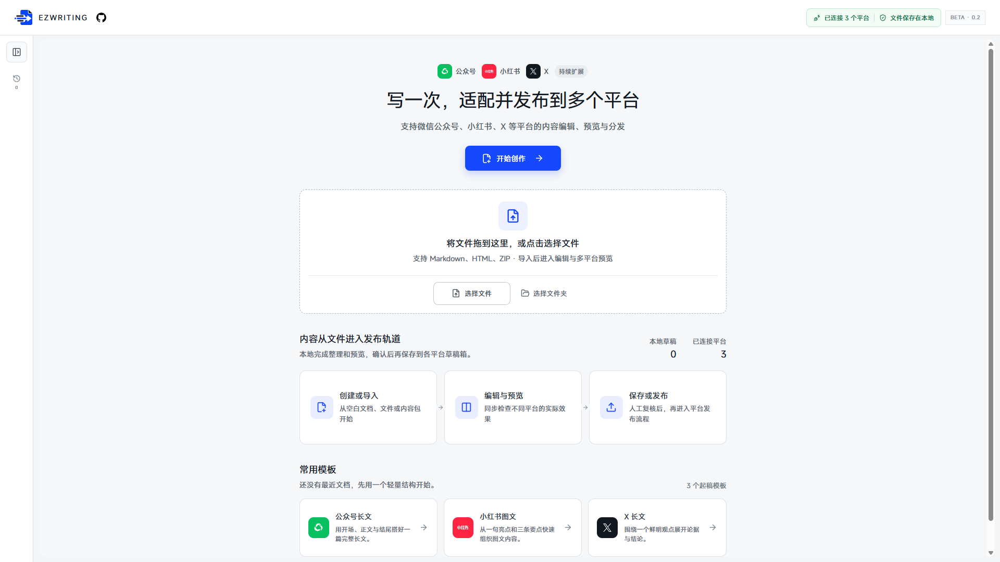
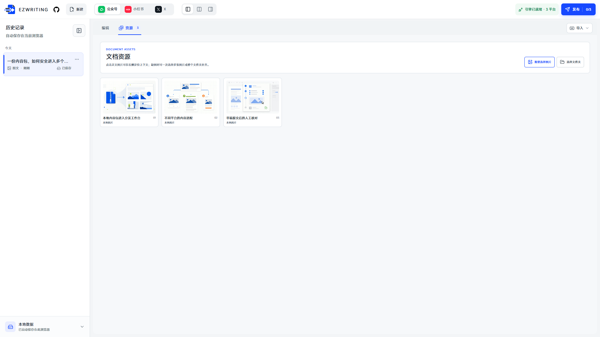
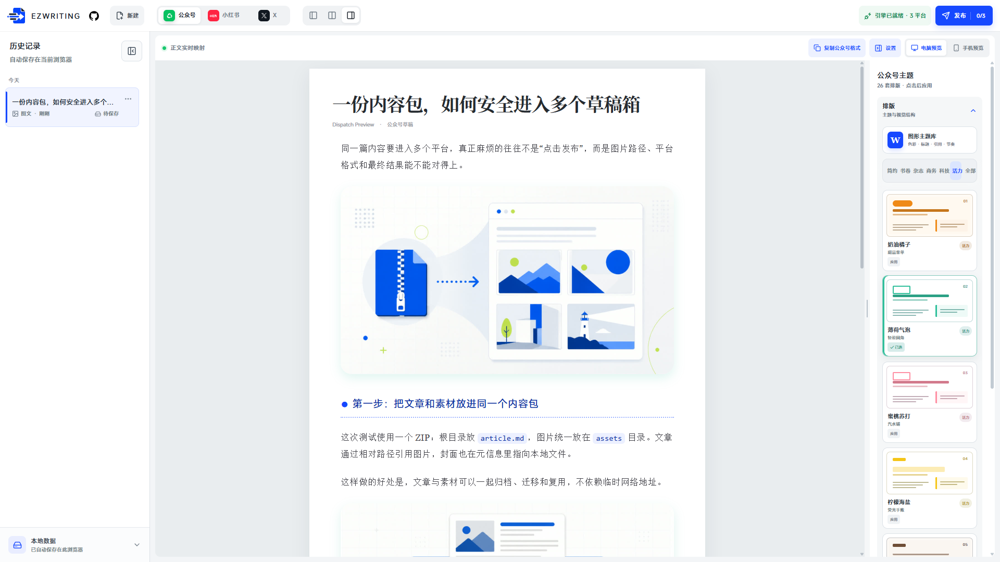
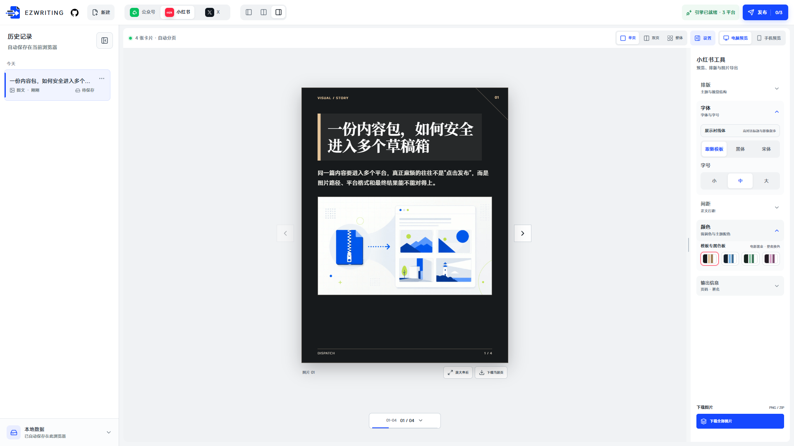
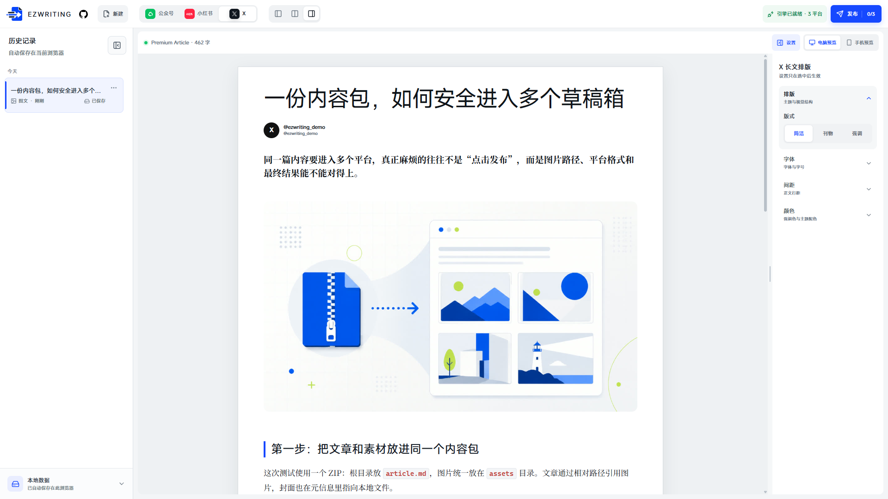
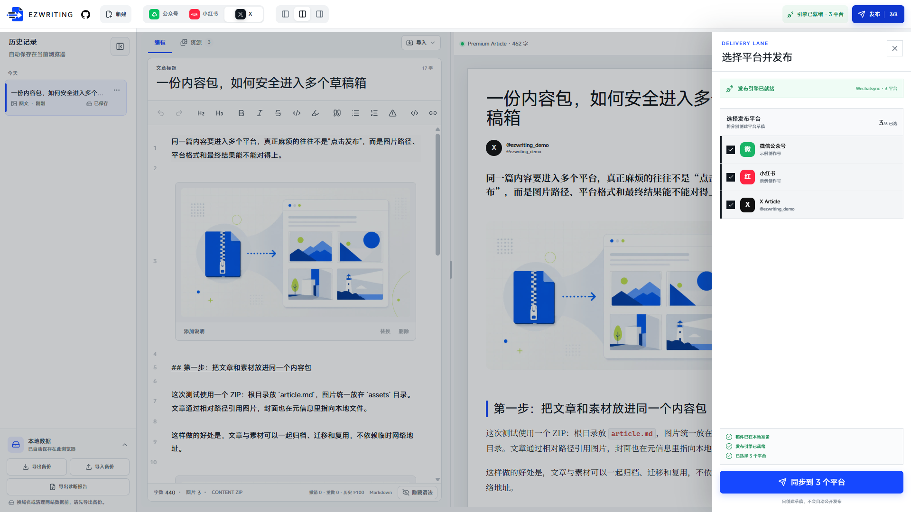

  <a href="./README_ZH.md">简体中文</a> · <strong>English</strong>

# EZWRITING

**A local-first workspace for multi-platform content preparation, formatting, and export**

Bring a Markdown, HTML, or ZIP article into the browser, then edit the source, organize assets, review platform layouts, export images, and optionally create drafts from one workspace.

[Live demo](https://ezwriting.online/) · [Feature tour](#feature-tour) · [Quick start](#quick-start) · [Platform support](./docs/PLATFORM_SUPPORT.md) · [Roadmap](./ROADMAP.md) · [简体中文](./README_ZH.md)

> [!IMPORTANT]
> EZWRITING is currently a public MVP. A desktop version of Chrome, Edge, or another Chromium browser is recommended. Importing, editing, previewing, backing up data, and exporting results work without an account. Draft delivery through [Wechatsync](https://github.com/wechatsync/Wechatsync) is an experimental enhancement and requires active sessions on the target platforms.

Current version: **v0.2.0 reliability release**. Before testing draft delivery, review the dated [platform support matrix](./docs/PLATFORM_SUPPORT.md) and [known issues](./docs/KNOWN_ISSUES.md). Platform pages, account permissions, and extension behavior can change independently of EZWRITING.

## What EZWRITING solves

Finishing an article is often the beginning of the publishing work. WeChat needs a formatting pass, Xiaohongshu needs image cards, X has a different long-form reading rhythm, and every platform adds another round of copying, image uploads, and draft checks. As the number of platforms grows, the versions drift apart.

EZWRITING keeps one canonical source in a local-first browser workspace. Platform previews turn that source into different presentations, while the final review and decision to create a platform draft remain with the user.

~~~mermaid
flowchart LR
    A["Markdown / HTML / ZIP / folder"] --> B["Local parsing and sanitization"]
    B --> C["One editable source"]
    C --> D["WeChat article"]
    C --> E["Xiaohongshu cards"]
    C --> F["X Article"]
    D --> G["Formatted copy / draft delivery"]
    E --> H["PNG / ZIP / draft delivery"]
    F --> I["Long-form preview / draft delivery"]
~~~

## Capability overview

| Stage | Current capability |
| --- | --- |
| Start | Empty document plus starter templates for WeChat, Xiaohongshu, and X |
| Import | Markdown, HTML, ZIP content packages, and folders containing an article with assets |
| Edit | Canonical Markdown, formatting tools, syntax display modes, images, local video, undo, and redo |
| Assets | Review body images, resolve missing files, select images or folders in bulk, replace, and remove |
| WeChat | 26 complete article themes, typography and color controls, desktop/mobile preview, formatted copy |
| Xiaohongshu | Automatic 3:4 pagination, 20 long-form layouts, 80 dedicated palettes, 7 template type systems, PNG and ZIP export |
| X Article | Long-form layouts, typography and accent controls, desktop/mobile preview |
| Local data | IndexedDB autosave, draft history, recoverable deletion, complete backup and restore |
| Diagnostics | Privacy-safe reliability report without article content, filenames, or account details |
| Delivery (beta) | Wechatsync detection, signed-in destinations, multi-select, progress, errors, and draft links |
| Safety | HTML sanitization, ZIP count and size limits, path-traversal rejection, drafts by default |

## Feature tour

### 1. Start from a blank page, a template, or an existing file

The homepage provides three ways to begin:

- Select **Start writing** for a blank draft.
- Use a WeChat article, Xiaohongshu image-post, or X long-form starter structure.
- Drop a file, or select a Markdown, HTML, ZIP, or article folder.

It also shows the number of local drafts, connected destinations, and recent documents. Files are parsed locally by default and open directly in the editing workspace.

### 2. Edit one source and review the result beside it

The left pane owns the canonical content; the right pane renders the active platform. The top bar switches between WeChat, Xiaohongshu, and X, and between editor-only, split, and preview-only layouts.

The editor includes:

- Separate title and Markdown body editing.
- Common controls for headings, lists, quotes, code, links, highlights, and media.
- Show/hide-syntax modes: the presentation mode hides most Markdown marks while the active line can still reveal its source.
- At least 100 recent independent editing events in the undo history, with visible undo/redo depth.
- Local image insertion, replacement, removal, and caption editing.
- Local MP4 and WebM insertion and playback up to 100 MiB per file; video plays only in the left editor, while platform previews use a stable poster frame and native-upload destinations receive an explicit manual-action note.
- Preview-to-source locating: select preview content to focus the corresponding source block.

The import menu inside the editor can append a file to the current source or replace the current draft.

### 3. Organize article images and unresolved assets

The **Assets** view collects body images in one place and shows their order and status. It can:

- Locate an image in its article context.
- Accept several replacement images or an entire asset folder.
- Relink unresolved local paths.
- Replace or remove a body asset without creating a separate platform version.

When a Markdown file is selected by itself, the browser cannot automatically read neighboring files. Select the complete article folder or use a ZIP package when the article references local assets.

### 4. WeChat Official Account: themes, formatting, and copy

The WeChat preview is designed around complete long-form article layouts:

- 26 graphic theme cards covering minimal, literary, editorial, business, technology, and energetic directions.
- Compact diagrams preview the color, heading, quote, and reading rhythm of every theme before it is applied.
- Each theme handles headings, body text, quotes, lists, dividers, and code as one system.
- Font, type size, body line height, and theme colors can be adjusted independently; several setting groups can remain open.
- Desktop and mobile effect previews.
- **Copy WeChat format** produces inline-styled content for pasting into the WeChat editor.

Always perform one final check in WeChat because the platform may sanitize pasted styles again.

### 5. Xiaohongshu: automatic pagination, visual templates, and image export

The Xiaohongshu preview turns a long article into 3:4 image cards:

- 20 long-form layouts grouped into inspiration, editorial, paper, information, and composition families.
- The compact three-panel diagrams preview each cover, article, and image-page composition.
- Every layout includes four dedicated palettes—80 combinations in total—covering the background, body, headings, accents, borders, and supporting colors as one system.
- Seven template type systems change with the selected layout, with manual sans-serif and serif overrides.
- Layout, font, spacing, and color sections expand independently; layouts define structure while palettes are selected from the **Color** section.
- Single-page, two-page spread, and complete overview modes, with direct page navigation.
- Full-size page inspection plus full-width or split image layouts and adjustable image width.
- 1080 × 1440 PNG export for an individual page and ZIP export for all cards.
- Independent page-number, footer, and attribution settings.

The selected layout, type system, palette, actual preview, pagination, and exported images all use the same resolved style.

This export path does not depend on the publishing extension and can be used for manual uploads to Xiaohongshu or other image-post platforms.

### 6. X Article: a dedicated long-form preview

The X preview arranges the title, author, and body as an Article and provides:

- Minimal, publication, and emphasis-oriented layouts.
- Font, type size, line-height, and accent-color controls.
- Desktop and mobile effect previews.
- Titles, images, code, and long-form structure synchronized with the canonical source.

Automated X Article draft creation depends on account eligibility and current platform behavior. Use the dated [platform support matrix](./docs/PLATFORM_SUPPORT.md) as the source of truth for tested status.

### 7. Local history, autosave, backup, and diagnostics

Drafts, images, local-video references, and formatting settings are stored in the current browser through IndexedDB. The sidebar shows each title, draft type, update time, and save status.

- Changes are autosaved without sending the document to an EZWRITING server.
- Switch between drafts, change the primary image/long-form type, soft-delete a draft, and undo a recent deletion.
- Export a complete <code>.ezwriting-backup.json</code> archive and restore it under another browser or domain.
- Export a privacy-safe diagnostic report with app/browser state and recent import timings, excluding article content, filenames, and account details.

Export a backup before clearing site data, changing browsers, or moving to another domain.

### 8. Optional multi-platform draft delivery

After Wechatsync is installed and the destination platforms are signed in within the same Chromium browser, EZWRITING can read the available accounts and open the delivery drawer:

- Select several destinations in one task.
- Check that the local draft, delivery engine, and destination selection are ready.
- Follow pending, processing, successful, and failed results per platform.
- Keep error explanations, manual-verification notes, and returned draft links.
- Create drafts by default; unattended public posting is not performed.

EZWRITING never asks for platform usernames or passwords. The executor uses sessions already present in the browser. Delivery is replaceable and optional: local import, editing, previews, and export do not depend on it.

## Supported input formats

| Input | Details |
| --- | --- |
| Markdown | <code>.md</code> and <code>.markdown</code>, including YAML front matter, standard image syntax, and Obsidian image references |
| HTML | <code>.html</code> and <code>.htm</code>; converted into editable Markdown while derived HTML is sanitized before rendering |
| ZIP | One Markdown or HTML article plus image assets referenced by relative path |
| Folder | A directory containing the article and its images, without manually creating an archive |

Recommended ZIP or folder structure:

~~~text
article/
├── article.md
└── assets/
    ├── image-01.jpg
    └── image-02.jpg
~~~

Standard Markdown and Obsidian image references are supported:

~~~markdown

![[assets/image-01.jpg]]
~~~

ZIP safety limits: 20 MB archive size, 120 files, 8 MB per decompressed file, and 30 MB total decompressed size. Absolute paths, <code>../</code>, and other path-traversal entries are rejected.

## Quick start

### Use the hosted workspace

Open the [EZWRITING public demo](https://ezwriting.online/):

1. Create a draft or import an article/package.
2. Edit the source and resolve images from the **Assets** view.
3. Review WeChat, Xiaohongshu, or X in the right pane.
4. Copy WeChat-formatted content, export Xiaohongshu images, or retain the prepared long-form output.
5. Install Wechatsync and sign in to destinations only if draft delivery is needed.

The local workflow requires neither an EZWRITING account nor the publishing extension.

For a quick import test, use the [plain Markdown sample](./examples/sample-article.md) or the [lightweight image content package](./examples/content-package-image-test-lite.zip).

### Run locally

Requirements: Node.js 24.15 or later.

~~~bash
git clone https://github.com/KeepATARAXIA/ezWriting.git
cd ezWriting
npm install
npm run dev
~~~

To test the Wechatsync bridge, open the <code>http://127.0.0.1</code> URL printed by the development server and enable the extension in the same browser.

Validation commands:

~~~bash
npm test
npm run typecheck
npm run build
npm run test:browser
npm run verify
~~~

<code>npm run verify</code> runs the unit/component suite, production build, and browser reliability gate.

## Local data and privacy

- The current version has no EZWRITING account system and does not sync local drafts to an EZWRITING server.
- Articles, images, local-video references, history, and formatting settings stay in the current browser by default.
- Remote images may still be requested by the browser or target platforms.
- Content is handed to the publishing extension and target platforms only after the user starts a delivery task.
- Diagnostic reports exclude article content, filenames, cookies, tokens, and account details.
- Before publishing a bug report, still check screenshots and logs for private draft links or unpublished content.

## Technical structure

EZWRITING uses React, TypeScript, and Vite. File handling, the article model, editing/previews, local persistence, and delivery remain separate, so the UI does not depend directly on Wechatsync private adapter structures.

| Layer | Responsibility | Location |
| --- | --- | --- |
| Article model | Normalized drafts, formatting, and saved state | <code>src/domain/</code> |
| File handling | Markdown / HTML / ZIP parsing, compatibility, and missing assets | <code>src/lib/file-parser.ts</code>, <code>src/lib/markdown-compatibility.ts</code> |
| Editing and previews | Markdown editor, three platform previews, and card export | <code>src/components/</code> |
| Local persistence | IndexedDB repository, autosave, and complete-library backups | <code>src/services/</code> |
| Publishing bridge | Replaceable Wechatsync web bridge | <code>src/lib/wechatsync-bridge.ts</code> |
| Static hosting | Cloudflare Worker health check and static assets | <code>cloudflare/worker/</code> |

## Current limitations

- The primary target is a desktop Chromium browser. Firefox, Safari, and mobile browsers cannot provide the same extension-based publishing flow.
- X Article draft creation depends on account eligibility and platform behavior and still needs broader real-account verification.
- Xiaohongshu and other image-post destinations primarily use PNG / ZIP export; draft behavior depends on the current Wechatsync response.
- Local video can play in the editor and applicable previews, but native media upload still needs destination-specific handling.
- Large videos are repeated as Base64 in complete-library backups, which may exceed the current 128 MiB backup-import limit. Keep the original videos and do not clear browser data assuming an oversized backup can be restored.
- Delivery creates drafts by default. Unattended publishing is intentionally out of scope.
- Accounts, cloud sync, scheduling, analytics, DOCX / PDF import, and AI rewriting are not included.
- This is still an MVP, and target-platform page changes may affect extension-based delivery.

See the [platform support matrix](./docs/PLATFORM_SUPPORT.md) and [known issues](./docs/KNOWN_ISSUES.md) for current verification status. Planned work is tracked in the public [roadmap](./ROADMAP.md), and notable changes are recorded in the [changelog](./CHANGELOG.md).

## Contributing

Focused bug reports and small pull requests are welcome. Read the [contributing guide](./CONTRIBUTING.md) before opening an issue, and remove cookies, tokens, account names, private draft links, and unpublished content from logs or screenshots.

## Acknowledgements

EZWRITING uses the open-source [Wechatsync](https://github.com/wechatsync/Wechatsync) project as its multi-platform publishing executor. Wechatsync was created by [fun](https://github.com/lljxx1) and is licensed under GPL-3.0.

EZWRITING handles file import, editing, asset management, platform previews, local history, and delivery feedback. Wechatsync handles platform adapters and the final synchronization step. The boundary remains explicit so the executor can be replaced.

## License

EZWRITING is released under the [MIT License](./LICENSE). Third-party notices and their original licenses are listed in [THIRD_PARTY_NOTICES.md](./THIRD_PARTY_NOTICES.md).
